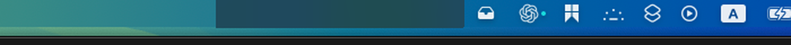

# StashBar

[English](README.md) | [简体中文](README.zh-CN.md)

A tiny macOS menu-bar utility that gives you a **drawer** for your menu bar —
built for notched MacBooks where the top bar has too little room for every
running app's status icon.

Think of it like a chest in Minecraft: things you toss in keep running, they
are just tucked out of sight until you open the lid.




## The problem

Notched MacBooks (14"/16" MacBook Pro, and the notch itself on any Mac with a
narrower usable menu-bar width) leave very little horizontal space in the top
bar. Apps that live only as a menu-bar icon — Cloudflare WARP, Dropbox, a VPN
client, a clipboard manager, whatever — start getting silently hidden behind
the notch or squeezed off-screen. The usual fix is quitting the app just to
free up space, and then relaunching it later to actually use it.

## What StashBar does

StashBar adds one small tray icon (🗃) to your menu bar. Everything to its
immediate left is a **stash zone**: hold ⌘ and drag any status icon into that
zone (the same gesture macOS already uses to rearrange menu-bar icons) and
StashBar visually covers it with a strip that matches the menu bar's own
material — the icon (and the app behind it) is still there and still
running, it is just hidden.

- **Click the drawer** → the cover slides away, every stashed icon becomes
  visible and clickable in its real position.
- **Click what you needed** (e.g. open Cloudflare WARP's menu) → the drawer
  auto-closes and re-covers the stash zone.
- **Right-click the drawer** → resize the stash zone, change auto-close
  timing, toggle Launch at Login.

No icons are removed, no apps are killed — this is a pure visual
show/hide toggle over a strip of the existing menu bar.

## Install

Requires macOS 13+ and Xcode Command Line Tools (`swift` on your PATH).

```bash
git clone https://github.com/zhuhroscar-tech/stashbar.git
cd stashbar
./build_app.sh
```

This builds a release binary, wraps it into `StashBar.app`, ad-hoc code-signs
it, installs it to `/Applications/StashBar.app`, and launches it. The tray
icon appears in your menu bar immediately.

Since the app isn't notarized, the very first launch triggered from Finder
may show an "unidentified developer" prompt — run `./build_app.sh` from the
terminal (as above) and macOS won't gate it the same way; if it still does,
right-click the app in Finder → Open, once.

## Usage

1. Hold **⌘** and drag a menu-bar icon so it sits to the **left** of the 🗃
   drawer icon.
2. It's now stashed — hidden, but the app behind it is still running.
3. **Click** 🗃 to open the drawer and use the icon normally.
4. The drawer re-covers itself automatically (default 6s, adjustable) or as
   soon as you click anything else.

Right-click 🗃 for settings:
- **Widen / Narrow Stash Zone** — how many points of menu bar the drawer
  covers.
- **Auto-close timer** — 4s / 6s / 10s / 20s / off.
- **Launch at Login**.

## How it works

StashBar is a small `NSStatusItem` plus a borderless `NSVisualEffectView`
window positioned one window-level above the system status bar
(`.statusBar + 1`), sized to match the real menu bar's height and vibrancy
material. Closing the drawer shows this window over the stash zone; opening
it calls `orderOut` so the real icons underneath become visible and
clickable again. It never intercepts clicks (`ignoresMouseEvents = true`) —
it's purely a visual cover, so nothing about how the stashed apps behave is
changed.

No accessibility permissions, no private APIs, no icon repositioning: it
does not move or rename other apps' status items, it only decides whether a
strip of the bar over them is currently painted or not.

## License

MIT
