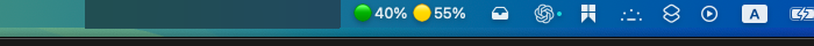

# StashBar

[English](README.md) | [简体中文](README.zh-CN.md)

A tiny macOS menu-bar utility that gives you a **drawer** for your menu bar —
built for notched MacBooks where the top bar has too little room for every
running app's status icon.

Think of it like a chest in Minecraft: things you toss in keep running, they
are just tucked out of sight until you open the lid, and the drawer opens
**downward** (never sideways) so it never fights the same scarce horizontal
space that caused the problem in the first place.

The 🗃 drawer icon sits in the menu bar; everything to its immediate left is
the stash zone, covered by a strip that blends into the bar's own material:



## The problem

Notched MacBooks (14"/16" MacBook Pro, and the notch itself on any Mac with a
narrower usable menu-bar width) leave very little horizontal space in the top
bar. Apps that live only as a menu-bar icon — Cloudflare WARP, Dropbox, a VPN
client, a clipboard manager, whatever — start getting silently hidden behind
the notch or squeezed off-screen. The usual fix is quitting the app just to
free up space, and then relaunching it later to actually use it.

## What StashBar does

StashBar adds one small tray icon (🗃) to your menu bar. Everything to its
immediate left is a **stash zone**: hold ⌘ and drag any status icon into that
zone (the same gesture macOS already uses to rearrange menu-bar icons).
StashBar covers the zone with a strip matching the menu bar's own material,
so the icon looks tucked away — the app behind it keeps running untouched.

- **Click the drawer** → a real panel drops down (grows downward, anchored
  under the icon) listing every currently-stashed app with a live thumbnail
  of its actual icon.
- **Click an entry** → StashBar clicks the real icon for you, at its real
  screen position, then closes the panel — same as if you'd clicked it
  directly, just without it taking up bar space the rest of the time.
- **Right-click the drawer** → resize the stash zone, toggle Launch at
  Login, grant Accessibility access.

No icons are removed, no apps are killed. Nothing about another app's status
item is ever moved, resized, or altered — StashBar only decides whether a
strip of the bar over it is currently covered, and whether to relay a click
to it.

## Install

Requires macOS 14+ and Xcode Command Line Tools (`swift` on your PATH).

Current source release: `v2.0.3`. See [CHANGELOG.md](CHANGELOG.md) for
release history.

```bash
git clone https://github.com/zhuhroscar-tech/stashbar.git
cd stashbar
make install
```

This builds a release binary, wraps it into `StashBar.app`, code-signs it,
installs it to `/Applications/StashBar.app`, and launches it. The tray icon
appears in your menu bar immediately.

Since the app isn't notarized, the very first launch triggered from Finder
may show an "unidentified developer" prompt — run `make install` from the
terminal (as above) and macOS won't gate it the same way; if it still does,
right-click the app in Finder → Open, once.

If a local code-signing identity named `StashBar Local Dev` already exists in
your login keychain, the build script uses it so rebuilding after a code
change does **not** reset the Accessibility/Screen Recording grants you make
below. If that identity is absent, the script falls back to ad-hoc signing and
macOS may ask for those grants again after a rebuild. The script also falls
back to ad-hoc signing if that identity exists but cannot be used by the
current non-interactive shell or CI runner.

## Usage

1. Hold **⌘** and drag a menu-bar icon so it sits to the **left** of the 🗃
   drawer icon. It's now stashed — hidden, but the app behind it is still
   running.
2. **Click** 🗃 — a panel drops down below it listing every stashed app with
   a live icon thumbnail.
3. **Click an entry** to operate it — StashBar forwards a real click to that
   app's actual icon and closes the panel.
4. Clicking anywhere else also closes the panel without acting on anything.

Right-click 🗃 for settings:
- **Widen / Narrow Stash Zone** — how many points of menu bar count as "the
  drawer".
- **Launch at Login**.
- **Grant Accessibility Access…** — required once for clicking stashed
  icons on your behalf (see below); StashBar still shows you every stashed
  icon with a live thumbnail even without it, it just can't click for you.

## How it works

Two independent, both fully public-API mechanisms:

**Detecting what's stashed.** Other apps' menu-bar icons are real on-screen
windows at a fixed CoreGraphics window level (`kCGStatusWindowLevel`, i.e.
layer 25). StashBar reads the public `CGWindowList` API to find any such
window whose position currently falls inside the stash zone — no private
APIs, no polling another process's internals.

**Showing you what's in there.** Each stashed icon's live pixels are grabbed
with `ScreenCaptureKit`'s `SCScreenshotManager`, scoped to just that one
window, so the panel always shows the *real*, current icon (a spinner, a
badge count, whatever), not a cached guess.

**Clicking on your behalf.** A plain synthetic click posted to another
process's PID is not reliable for menu-bar buttons on current macOS — the
event also needs the target window's ID set in a couple of undocumented
`CGEventField` slots, a technique cross-checked against the open-source
[Ice](https://github.com/jordanbaird/Ice) menu-bar manager's own
`MenuBarItemManager.click(item:)`. This requires Accessibility permission,
the same gate any app posting synthetic input events into another process
needs; StashBar shows a plain, dismissible hint in the panel until it's
granted, and still shows/detects everything else without it.

**The panel itself** is a borderless `NSPanel` whose frame is recomputed on
every open: same top-left anchor point regardless of how many items it's
showing, height grows to fit, width never changes — see
`Tests/StashBarTests/DrawerPanelLayoutTests.swift` for the exact invariant
this locks in (`panelGrowsDownwardNotSideways`).

## Testing

```bash
make test    # pure-logic unit tests: zone math, panel sizing, event fields
make package # build and sign dist/StashBar.app without installing or launching
make check   # tests + a package-only app build
```

The test suite (`swift-testing`, no Xcode required) covers the parts that
used to require manually clicking through the real menu bar to verify:
which icons count as "in the zone" (`StashScannerTests`), that the panel's
frame math genuinely only grows downward and never sideways or leftward
(`DrawerPanelLayoutTests`), and that the synthetic click events carry the
right target process/window fields (`ClickForwarderTests`). None of it
touches a real window, a real screen, or your actual mouse cursor.

## License

[MIT](LICENSE)
